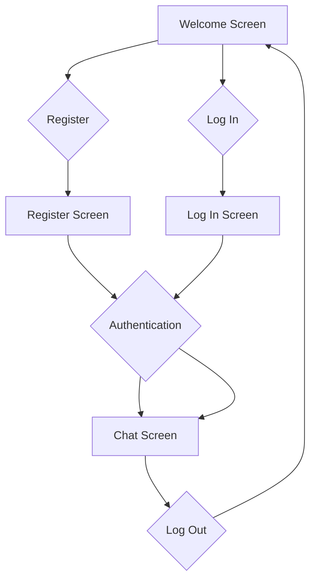

# ChatBob

- Firebase
- Networking (URLSession)
- UIKit
- Dependencies
- Model-View-Controller
- A Chat Group where people can register and send messages
- Uses Firebase Firestore to read and populate chats
- CLTypingLabel for animating characters
 
### User flow diagram of the app

